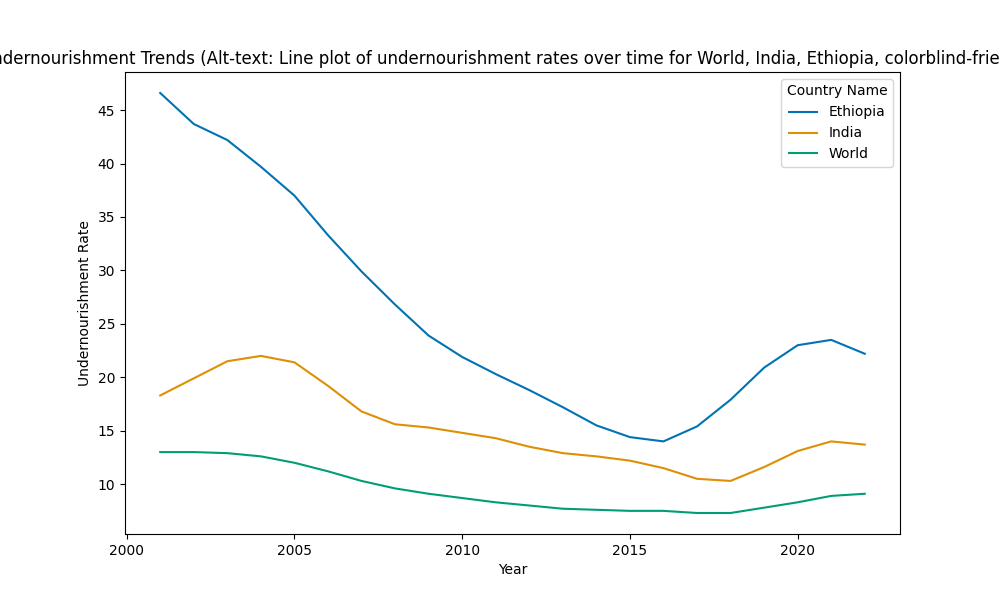

# Food Insecurity Clustering and Nutritional Gap Analysis (SDG 2: Zero Hunger)

## Problem Statement
SDG 2 seeks to end hunger, achieve food security, and improve nutrition. This project clusters countries by food insecurity levels and models contributing factors, providing policy recommendations.

## Data Source & Ethics Disclaimer
- Source: FAO/World Bank Prevalence of Undernourishment: https://data.worldbank.org/indicator/SN.ITK.DEFC.ZS (Download as ZIP containing CSV)
- Ethics: Data is aggregated and public; potential biases include underrepresentation of low-income regions or informal economies. No personal data used. Limitations: Historical data may not capture recent events like crises. Ensure ethical use by addressing biases in analysis.

## Methods Used
- EDA: Pandas for cleaning, Matplotlib/Seaborn for visuals.
- Modeling: Unsupervised ML (DBSCAN clustering), statistical inference (ANOVA tests with scipy), interactive dashboards (Plotly Dash).
Plain-language: We clean the data, explore patterns, build models to predict or analyze outcomes, and visualize results for clarity.

## Key Findings
- Historical data shows varying undernourishment trends for World, India, and Ethiopia from 2000 to 2020 (see results/undernourishment_trends.png).
- DBSCAN clustering groups countries by undernourishment rates in the latest year, identifying high-hunger outliers.
- Plain-language summary: This analysis shows how hunger levels differ across countries and groups them by severity.

## How to Reproduce
1. Clone repo: `git clone [https://github.com/ClarenceKaranja/SDG2-Food-Insecurity-Clustering-and-Nutritional-Gap-Analysis]`
2. Install deps: `pip install -r requirements.txt`
3. Download data: Follow links in data/data_sources.md (or run src/download_data.py if available)
4. Run notebook: `jupyter notebook notebooks/main.ipynb`
5. Optional: Run dashboard: `streamlit run src/app.py`

## Future Improvements
- Integrate real-time API data for updates.
- Add multilingual support in documentation.
- Explore extensions like incorporating user-contributed data via PRs.
- Enhance bias mitigation with advanced fairness libraries.
